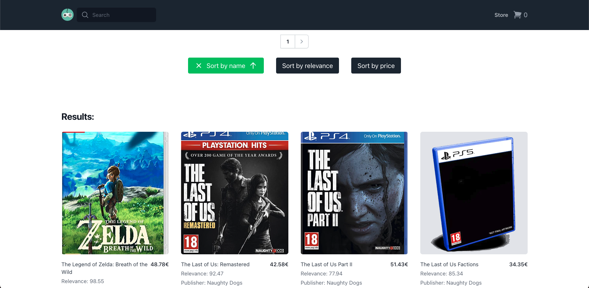
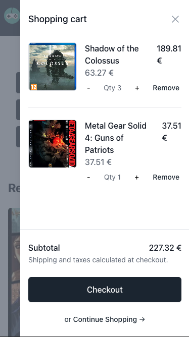
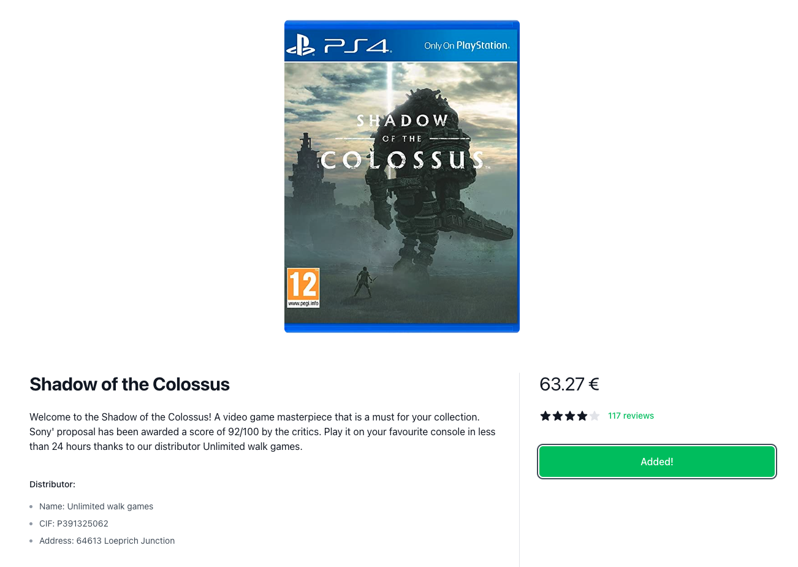

# FULL-STACK E-COMMERCE - PIXEL PALACE
Frontend, backend and data base design online store project.


This is an e-commerce web application built on the MERN stack, with a RESTful API connected to a MongoDB. With React and Redux on the front-end for user interactivity and state management.


<br>

## Technologies Used

- MongoDB
- Express
- Node.js
- ReactJS
- Mongoose ODM
- Tailwind CSS framework
- Axios
- React Router
- Redux
- Component lifecycle methods (useEffect)
- useContext and props communication.


<br>
 
## Installation:

To install this project, you´ll just need to follow three steps:

 
- Clone the repository to your local machine.
- Add your MONGO ATLAS URL to your .env file (you had an .env.example included) or connect to your localhost Mongo connection.
- Run these commands:
``````
npm install
``````
``````
npm run clientinstall
``````
``````
npm run feed_db
``````
``````
npm run dev
``````

<br>


<br>

## Features:

This React application has the following main features:

- `Back-end filter, order and pagination`: Back-end pagination keeps consistent data presentation and optimizes front-end loading by breaking down data into smaller and more manageable chunks. Requests use queries params to filter the content.

- `Redux`: Utilized for state management of the shopping cart.

- `Communication through props and context`: React context is used to manage the handle communication between some components like search bar and the store. All the structure is divided in components with props communication to make the code easier to handle.

- `Debounce`: Search bar without buttons.

- `Component lifecycle methods (useEffect)`: React's component lifecycle methods are used to manage the state of the application and handle events. The useEffect hook allows to manage side effects and update the state of the application when it´s needed. Just write your search in the bar and the state of the application will update in 2 secs.

- `Routing and passing information through links`: React Router is used to handle navigation between pages and passing information through link params when a more detailed view of the product is needed..

- `Tailwind`: Styling is done using Taildwind, a utility-first CSS framework.

- `Modular structure and function components`: The application is built using function components, making it lightweight and easy to maintain. Components are organized into a modular and reusable structure, making it easy to maintain and extend the application.

- `Data manage`: For those case where there is no complete info of the data.

- `Mobile first design`

With these features, this application provides a user-friendly interface for browsing and purchasing video games, with robust back-end functionality to support seamless data management.

<br>



<br>

## Usage:

- `Header`: A search bar and a shopping cart icon. The search bar has a debounce function, which filters results by both video game title and distributor. This allows the user to easily search and find the specific video game or distributor they are looking for. The shopping cart icon displays the number of items currently in the user's shopping cart, and it updates dynamically as items are added or removed. Users can click on the shopping cart icon to view the contents of their cart and proceed to checkout.

- `Store`:  The initial view of our e-commerce web application presents a list of video games that can be filtered using three buttons - "Name", "Relevance", and "Price". All with asc or des order depending on the clicks. The list is displayed in a paginated format, with 10 games per page, and the pagination allows the user to navigate between pages easily. No buttons appears if there are no more videogames ahead. Each video game item in the list displays its info and two buttons displayed alongside each item - "Add to Cart" and "View Details".

- `Details view`: The detailed view uses react router params to make another API call to retrieve the distributor information for the video game based on its public ID. The page also features an "Add to Cart" button, which changes its display if the game has already been added to the user's cart. Additionally, the detailed view displays a star rating system that reflects the relevance score of the video game. This view provides users with more detailed information about the video game, including its distributor, and allows them to easily add it to their shopping cart.

- `Shopping Cart`: The shopping cart is displayed as an overlay on the right-hand side of the page, allowing users to easily access and modify their cart contents. Users can adjust the quantity of items in their cart, and also remove items completely. As items are added or removed, prices are dynamically updated, providing users with an up-to-date breakdown of their costs. This shopping cart feature offers users a convenient and user-friendly way to manage their purchases and checkout.

- `Order`: After selecting the "checkout" button, our e-commerce web application directs users to a final page that displays the details of their order. This page provides a summary of the user's selected items, as well as the total cost.

<br>



<br>

Contributions are always welcome! If you have any ideas, suggestions, or find any issues, please don't hesitate to open an issue or submit a pull request. Thank you for using and supporting this project!


<br>


## Author:


[Fran V. Hernández](https://github.com/Francsy/)

